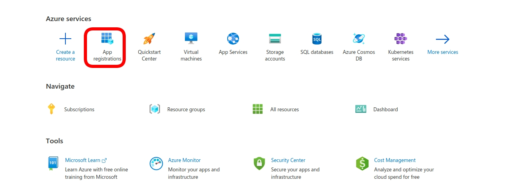
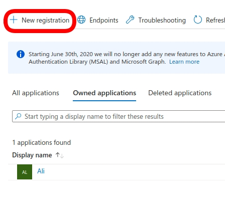
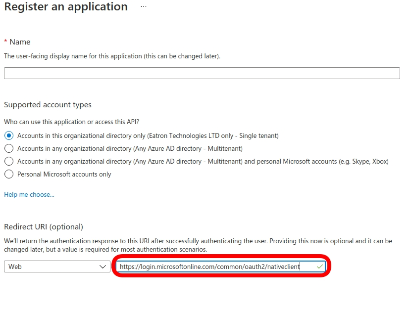
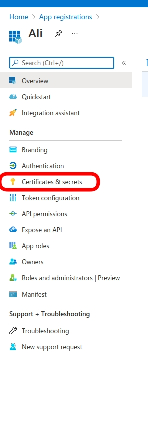
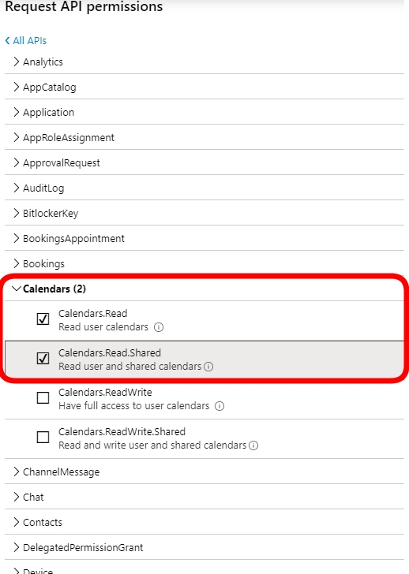
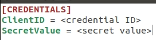
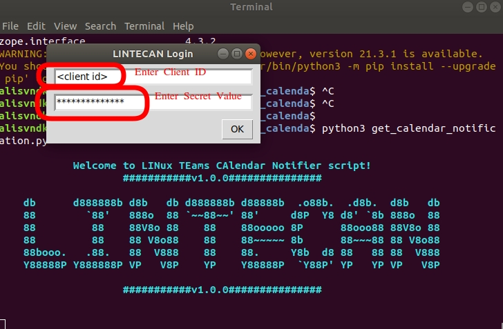

## Authors
- Ali Sevindik - Arduino Hocam: `arduino.hocam@gmail.com`
- version: `1.0.0`

## Purpose
In Linux, there is no official `outlook` application. There are some workaround solutions but I don't trust third party
applications especially if you are working in a company it would be dangerous in terms of security!

Since `MS Teams` meetings are syncronized with `outlook`, if you are using Windows OS, `outlook` application
provides quite good Calendar Notifications before 15 mins(this can be changed by user). However this is not 
possible in Linux. There is no official outlook app as mentioned before.

This simple script is aim to overcome this problem.

`lintecan.py` stands for **LIN**ux **TE**ams **CA**lendar **N**otifier

## Prerequisites
This script is tested on GNU/Linux Ubuntu 18.04 with Python 3.6.9.
Following `pip` packages are required (tested versions are also listed):
- O365 == 2.0.16
- datetime == 4.3
- colorama == 0.3.7
- notify2 == 0.3.1
- datetime == 4.3
- tk == 0.1.0
  
## Installation
- Clone the repository
- Install pip packeges using requirements.txt `pip install -r requirements.txt`

In order to communicating with the MS Outlook API, `O365` Python library is used.
Docs for the `O365` : [O3365 docs](https://pypi.org/project/O365/)

Following steps needs to be done inr order to set up environment so that you can query
your Outlook Calendar. (Mail, Teams, Groups, Tasks .... there are many things you
can query)

- Navigate to the [MS Azure portal ](https://portal.azure.com/#home)
- SignIn with your organization’s account, open the `App Registrations`

- Create a new registration If you don't have one.

- Set the Redirect URI to `https://login.microsoftonline.com/common/oauth2/nativeclient`

-  Select the `Who can use this application or access this API?` part, I think I've selected Multitenant for the
ease of use.

- Complete the remaining required parts and click on the `register`
- You will see `Display name`, `Application(client) ID`, `Directory(tenant) ID`, `Object ID` and their values.
- Generate `Secret Key` by clicking on `Certificates & secrets`
  

- Click on `New client secret` and set the expiration time to your needs.
- Copy the secret key into somewhere you can store. We will use this value.
- Click on `API permisisons` tab
- Click on `Add permissions`
- Select `Microsoft Graph API`
- Select `Delegated Permissions` -> Interraction required everytime.
- Scroll down to select required APIs, In our case choose `Calendar`
- Select `Calendars.Read` and `Calendars.Read.Shared` these are the ones we will need for calendar notification

- You are Ready now.

## How to Run Script

Script supports commandline arguments, for more detail type `python3 lintecan.py --help`

There are two options for you to enter credentials.

- Use Credential file to type your credentials: `python3 lintecan.py --credential_file <filename>.ini`

Your `ini` file should look like this:

<em>**Note:**This method obviously dangerous!! I'd recommend to use second method.`</em>

- Use GUI to enter your credentials.
  - Run the script without any arguments : `python3 lintecan.py`
  - A GUI wil pop up, enter credential ID and Secret value, click OK.

- There will be a link on the console, click the link. Copy the poped up URL to the console
- You are ready!!!
- Inside the code, for now, Time for the `REMAINING_TIME_LIM` is hard-coded. You can change according to your needs!

Script is running inside infinite loop for now.

## Updates
- v1.0.1 -> `offline_access` scope is added for token expiration problem. Script should now work 90 Days.

